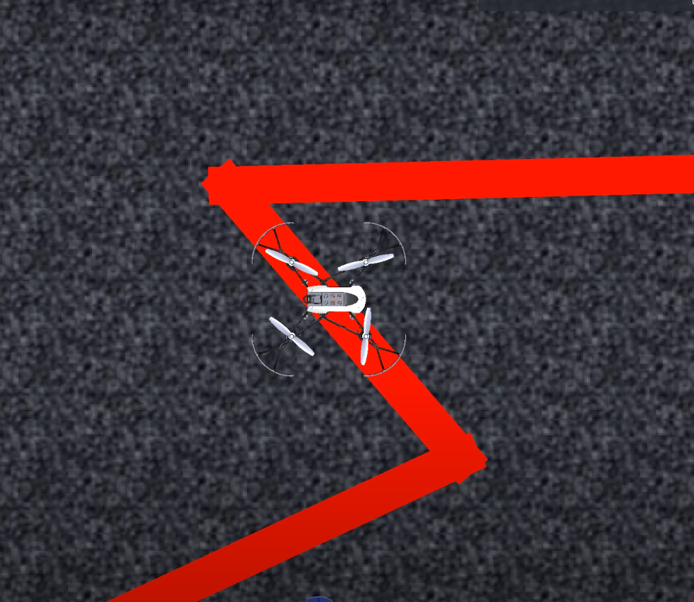
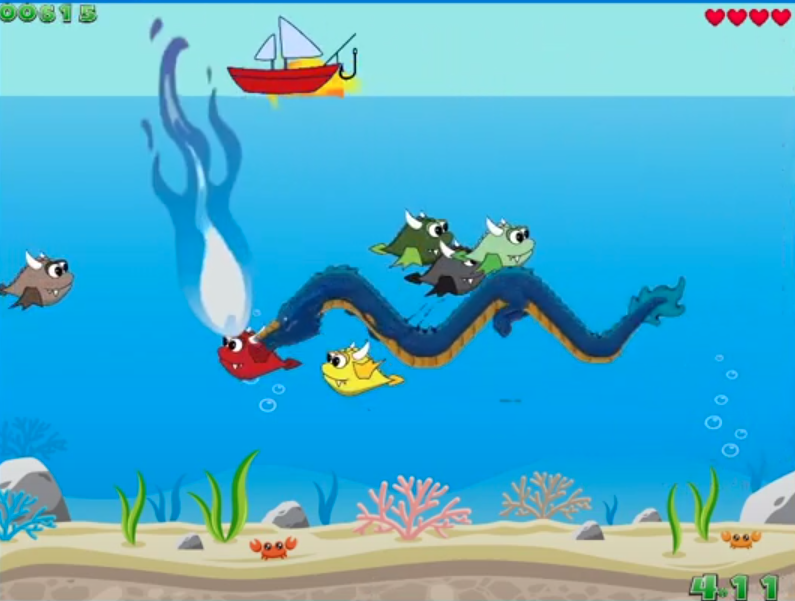

<header class="page-header">
  

    <h1 class="page-title">Projects</h1>
    
Research projects and technical work

  

</header>

  

<!-- ===========================================
     PROJECT TEMPLATE - Copy this block to add new projects:

     <article class="card">
       
       

         <h3 class="card-title">Project Title</h3>
         
Institution/Context (Year)

         
Brief description of the project, what you built, and key technologies used.

         

           <a href="THESIS_URL" class="btn btn-primary" target="_blank"><i class="fas fa-book"></i> Thesis</a>
           <a href="CODE_URL" class="btn btn-secondary" target="_blank"><i class="fab fa-github"></i> Code</a>
           <a href="VIDEO_URL" class="btn btn-secondary" target="_blank"><i class="fas fa-video"></i> Video</a>
         

       

     </article>
     =========================================== -->

    <article class="card">
      
      

        <h3 class="card-title">Connectivity Maintenance in Ad-hoc UAV Networks for Multi-robot Missions</h3>
        
Master's Thesis - University of Zagreb (2024)

        
Modified a classic connectivity controller to include battery awareness and fault tolerance for a swarm of UAVs. Analyzed the feasibility of Graph Neural Networks (GNNs) for imitation learning. Demonstrated a full fleet management system using Bitcraze Crazyflie UAVs.

        

          <a href="https://drive.google.com/file/d/1AOIqtehMHJ_R36bMlAusND14YsxL6YSP/view?usp=sharing" class="btn btn-primary" target="_blank"><i class="fas fa-book"></i> Thesis</a>
        

      

    </article>

    <article class="card">
      
      

        <h3 class="card-title">Flocking, Rendezvous and Formation Control of Multi Agent Systems</h3>
        
University of Zagreb (2023)

        
Implemented Reynolds' rules to simulate decentralized flocking in Stage Simulator for unicycle dynamic agents. Developed consensus-based rendezvous and formation control in Stage Simulator.

        

          <a href="https://github.com/KhAlamdar11/ReynoldsSwarmSim" class="btn btn-secondary" target="_blank"><i class="fab fa-github"></i> Code</a>
          <a href="https://youtube.com/playlist?list=PL_eKUkXsvo0Y0a8hcg0ggh9Zck--EYpBf&si=67LfecFRll7DdZa2" class="btn btn-secondary" target="_blank"><i class="fas fa-video"></i> Video</a>
        

      

    </article>

    <article class="card">
      
      

        <h3 class="card-title">Autonomous Pick and Place using TurtleBot</h3>
        
Universitat de Girona (2023)

        
Implemented multiple frontier selection and path planning algorithms with smoothing techniques. Integrated with self-implemented SLAM for mapping and localization, enabling fully autonomous pick-and-place.

        

          <a href="https://youtube.com/playlist?list=PLwVnz1vBGxmIpFFC4FakAl2B1OGoyhWDm&si=KPjzlDpfqRWSE1MR" class="btn btn-secondary" target="_blank"><i class="fas fa-video"></i> Video</a>
        

      

    </article>

    <article class="card">
      
      

        <h3 class="card-title">Autonomous Mapping and Human Localization for Indoor Disaster Management UAVs</h3>
        
Bachelor's Thesis - Habib University (2022)

        
Developed an exploration algorithm tailored for UAVs in GPS-denied environments. Implemented a module to detect and localize human survivors using YoloV3. Simulated using a PX4 quadrotor in disaster-like environments.

        

          <a href="https://hira.habib.edu.pk/jspui/handle/123456789/476" class="btn btn-primary" target="_blank"><i class="fas fa-book"></i> Thesis</a>
          <a href="https://www.youtube.com/watch?v=EyEW8sv9_-g" class="btn btn-secondary" target="_blank"><i class="fas fa-video"></i> Video</a>
        

      

    </article>

    <article class="card">
      
      

        <h3 class="card-title">Mathworks Minidrone Competition (EMEA '21)</h3>
        
Mathworks Competition (2021)

        
Designed and implemented image processing and path planning algorithms to make Parrot Mambo mini-drone follow a line in Simulink simulation. A unique approach was used to make the drone follow the line on very steep turns.

        

          <a href="https://github.com/mk04366/Mathworks_Line_Following_Drone" class="btn btn-secondary" target="_blank"><i class="fab fa-github"></i> Code</a>
          <a href="https://www.youtube.com/watch?v=9oJo_8JWI98" class="btn btn-secondary" target="_blank"><i class="fas fa-video"></i> Video</a>
        

      

    </article>

    <article class="card">
      
      

        <h3 class="card-title">WHEEL-E: A Self-Balancing Robot</h3>
        
Habib University (2020)

        
A self-balancing robot developed as the final project for Principles of Feedback Control course. The bot was capable of balancing itself and maintaining upright position on 2 wheels. Arduino UNO R3 along with MPU6050, L298N motor driver and Pololu gear motors were used. PID algorithm was implemented for balance control.

        

          <a href="https://github.com/KhAlamdar11/WHEEL-E" class="btn btn-secondary" target="_blank"><i class="fab fa-github"></i> Code</a>
          <a href="https://youtu.be/H8IEg2Rn4-M?si=s9FixfFCOtKjuyyL" class="btn btn-secondary" target="_blank"><i class="fas fa-video"></i> Video</a>
        

      

    </article>

    <article class="card">
      
      

        <h3 class="card-title">Mariana Trench Fishing</h3>
        
Habib University (2020)

        
A fishing game developed as the final project for the Object Oriented Programming (OOP) course. Developed using C++ and SDL library with engaging gameplay mechanics.

        

          <a href="https://www.youtube.com/watch?v=ITSI3_9rEnk" class="btn btn-secondary" target="_blank"><i class="fas fa-video"></i> Video</a>
        

      

    </article>

  

